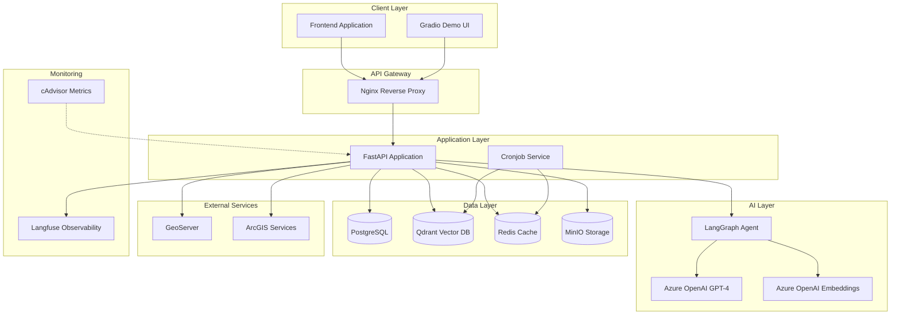
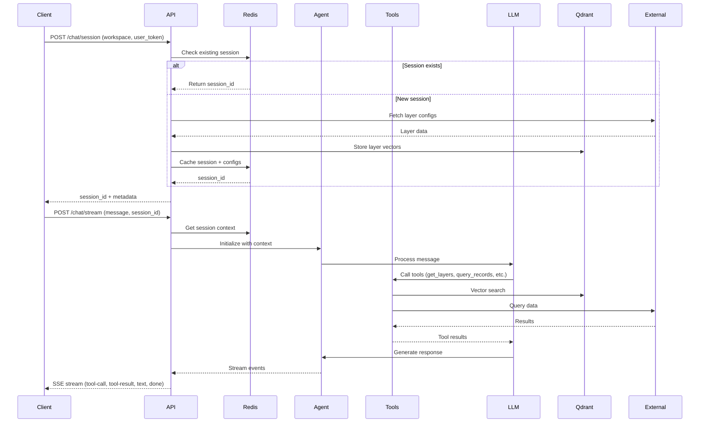
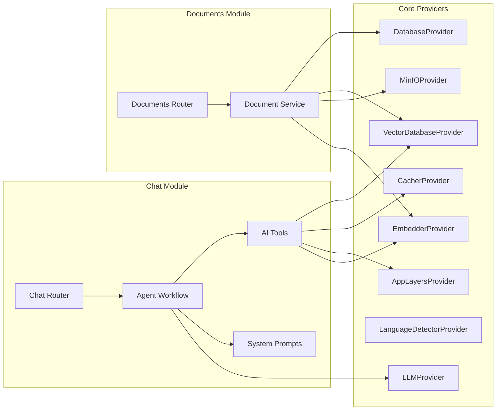
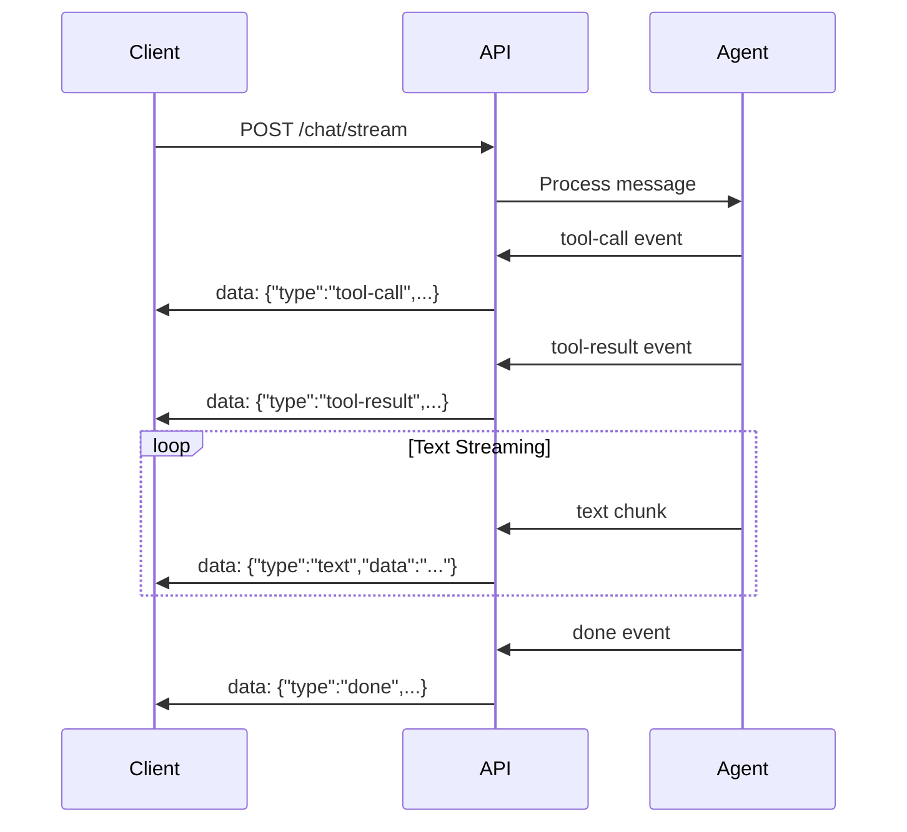
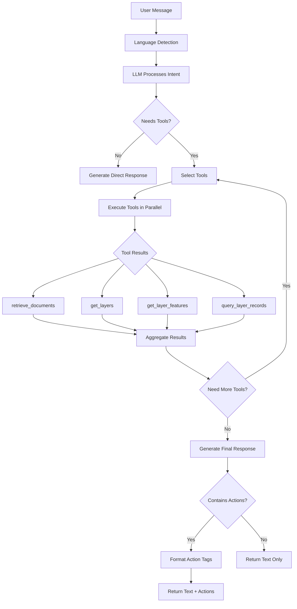

# TECHNICAL DOCUMENT 
> Up - Intertown Chatbot

## Introduction

**Up - Intertown Chatbot** is an AI-powered conversational assistant designed for the **"Up – by Intertown"** GIS system used by the Sorkot Regional Planning and Building Committee. The chatbot enables users to interact with spatial data, query map layers, manage documents, and perform GIS operations through natural language conversations in Hebrew and English.

The system leverages:
- **LangChain/LangGraph** for AI agent orchestration
- **Azure OpenAI** for language understanding and generation
- **Qdrant** for vector-based semantic search
- **FastAPI** for high-performance RESTful APIs
- **Redis** for session caching and data management
- **PostgreSQL** for metadata storage
- **MinIO** for object storage

This document provides comprehensive technical specifications for backend and frontend developers integrating with the chatbot system.

---

## Table of Contents

1. [Introduction](#introduction)
2. [Architecture Overview](#architecture-overview)
   - [System Architecture](#system-architecture)
   - [Data Flow](#data-flow)
   - [Component Diagram](#component-diagram)
3. [Technical Stack](#technical-stack)
4. [Core Components](#core-components)
   - [Providers](#providers)
   - [Modules](#modules)
5. [API Reference](#api-reference)
   - [Chat API](#chat-api)
   - [Documents API](#documents-api)
   - [Health Check](#health-check)
6. [Streaming Protocol](#streaming-protocol)
7. [WebSocket STT Integration](#websocket-stt-integration)
8. [AI Workflow & Tools](#ai-workflow--tools)
   - [System Prompt](#system-prompt)
   - [Available Tools](#available-tools)
   - [Tool Execution Flow](#tool-execution-flow)
9. [Action Tag Format](#action-tag-format)
10. [Database Schema](#database-schema)
11. [Deployment Guide](#deployment-guide)
    - [Prerequisites](#prerequisites)
    - [Docker Deployment](#docker-deployment)
    - [Local Development Setup](#local-development-setup)
12. [Environment Configuration](#environment-configuration)
13. [Cronjob Tasks](#cronjob-tasks)
14. [Troubleshooting](#troubleshooting)

---

## Architecture Overview

### System Architecture



### Data Flow



### Component Diagram



---

## Technical Stack

| Category | Technology | Version | Purpose |
|----------|-----------|---------|---------|
| **Framework** | FastAPI | 0.120+ | RESTful API & WebSocket server |
| **AI Orchestration** | LangChain | 1.0+ | Agent framework |
| **AI Orchestration** | LangGraph | Latest | State machine for agent workflows |
| **LLM** | Azure OpenAI | GPT-4 | Language understanding & generation |
| **Embeddings** | Azure OpenAI | text-embedding-3-small | Vector embeddings (1536 dims) |
| **Vector Database** | Qdrant | 1.15+ | Semantic search for documents & layers |
| **Cache** | Redis | 7.x | Session management & layer caching |
| **Database** | PostgreSQL | 17 | Document metadata storage |
| **Object Storage** | MinIO | Latest | File storage (documents) |
| **Observability** | Langfuse | 3.x | LLM tracing & monitoring |
| **Metrics** | cAdvisor | 0.51+ | Container metrics (optional) |
| **Speech-to-Text** | Azure Cognitive Services | 1.46+ | Real-time speech recognition |
| **Reverse Proxy** | Nginx | Latest | Load balancing & SSL termination |
| **Containerization** | Docker & Docker Compose | Latest | Service orchestration |
| **Task Scheduler** | Cron | Native | Scheduled maintenance tasks |

---

## Core Components

### Providers

Providers are singleton classes that manage connections to external services and provide reusable functionality across the application.

#### 1. **DatabaseProvider** (`app/core/providers/database.py`)
- Manages PostgreSQL connections using SQLModel
- Provides session management for database operations
- Used for storing document metadata

#### 2. **VectorDatabaseProvider** (`app/core/providers/vectordb.py`)
- Wrapper around Qdrant client
- Manages vector collections for documents and layers
- Auto-initializes collections on startup
- Supports semantic search and filtering

#### 3. **CacherProvider** (`app/core/providers/cacher.py`)
- Redis client wrapper
- Handles session caching (default TTL: 1 day, adjustable)
- Stores layer configurations and workspace mappings
- JSON serialization/deserialization support

#### 4. **EmbedderProvider** (`app/core/providers/embedder.py`)
- Azure OpenAI embeddings wrapper
- Generates 1536-dimensional vectors
- Supports batch embedding for performance

#### 5. **LLMProvider** (`app/core/providers/llms.py`)
- Azure OpenAI chat model provider
- Configurable model selection (default: gpt-4)
- Supports streaming responses

#### 6. **MinIOProvider** (`app/core/providers/minio_client.py`)
- MinIO S3-compatible object storage client
- Handles document uploads/downloads
- Generates unique filenames and presigned URLs

#### 7. **LanguageDetectorProvider** (`app/core/providers/language_detector.py`)
- Detects user language (Hebrew/English)
- Influences response language only
- Does not affect tool execution

#### 8. **AppLayersProvider** (`app/core/providers/layers/`)
- Fetches layer configurations from GeoServer and ArcGIS
- Queries layer features and records
- Handles authentication (user_token for GeoServer)
- Provides CQL filter parsing

### Modules

#### 1. **Chat Module** (`app/modules/chat/`)
Handles all chat-related functionality:
- **Router** (`router.py`): API endpoints for sessions, chat, streaming, and STT
- **Workflow** (`create_workflow.py`): LangGraph agent creation and tool binding
- **Tools** (`tools/`): AI tools for document retrieval, layer operations, and basemap control
- **Prompts** (`prompts/`): System prompts defining bot behavior
- **Interfaces** (`interfaces/`): Request/response schemas

#### 2. **Documents Module** (`app/modules/documents/`)
Manages document lifecycle:
- **Router** (`router.py`): CRUD endpoints for documents
- **Service** (`services.py`): Business logic for upload, chunking, embedding, and storage
- **Interfaces** (`interfaces/`): Document data models

---

## API Reference

Base URL: `http://localhost:8000/api`

All endpoints return responses in the following format:

```json
{
  "message": "Success message",
  "data": { /* response data */ }
}
```

### Chat API

#### 1. Create Chat Session

**Endpoint:** `POST /chat/session`

Creates a new chat session or reuses an existing one for a workspace. This endpoint fetches layer configurations, stores them in the vector database, and caches session metadata.

**Request Body:**
```json
{
  "workspace": "workspace_id",
  "user_token": "unique_user_uuid",
  "expired_time": 86400,
  "force_refetch_data": false
}
```

**Parameters:**
- `workspace` (string, required): Workspace identifier for layer grouping
- `user_token` (string, required): Unique UUID for GeoServer authentication
- `expired_time` (integer, optional): Session TTL in seconds (default: 86400 = 1 day)
- `force_refetch_data` (boolean, optional): Force refetch even if session exists

**Response:**
```json
{
  "message": "Session created successfully",
  "data": {
    "session_id": "550e8400-e29b-41d4-a716-446655440000",
    "expired_at": "2025-11-11T12:00:00Z",
    "num_layers": "45",
    "num_basemaps": "3"
  }
}
```

**JavaScript Example (Axios):**
```javascript
const axios = require('axios');

async function createSession(workspace, userToken) {
  try {
    const response = await axios.post('http://localhost:8000/api/chat/session', {
      workspace: workspace,
      user_token: userToken,
      expired_time: 86400
    });
    
    console.log('Session ID:', response.data.data.session_id);
    return response.data.data.session_id;
  } catch (error) {
    console.error('Error creating session:', error.response.data);
  }
}

// Usage
const sessionId = await createSession('my_workspace', 'user-uuid-123');
```

---

#### 2. Chat (Non-Streaming)

**Endpoint:** `POST /chat/`

Send a message and receive a complete response.

**Request Body:**
```json
{
  "session_id": "550e8400-e29b-41d4-a716-446655440000",
  "message": "הראה לי את שכבת החלקות הכחולה",
  "histories": [
    {
      "role": "user",
      "content": "שלום",
      "metadata": {}
    },
    {
      "role": "assistant",
      "content": "שלום! במה אוכל לעזור?",
      "metadata": {}
    }
  ],
  "metadata": {}
}
```

**Parameters:**
- `session_id` (string, required): Session ID from `/chat/session`
- `message` (string, required): User message in Hebrew or English
- `histories` (array, optional): Previous conversation history
- `metadata` (object, optional): Additional metadata

**Response:**
```json
{
  "message": "OK",
  "data": {
    "role": "assistant",
    "content": "מצאתי את השכבה 'חלקות כחולות'. השכבה נמצאת תחת:\n- קבוצת המגרשים\n  - חלקות\n...",
    "metadata": {
      "execution_time": 2.45,
      "total_tokens": 850,
      "cql_query": null,
      "actions": [
        "tag:action:layer-show:geoserver:(srk_parcels_blue)"
      ]
    }
  }
}
```

**JavaScript Example:**
```javascript
async function sendMessage(sessionId, message, histories = []) {
  try {
    const response = await axios.post('http://localhost:8000/api/chat/', {
      session_id: sessionId,
      message: message,
      histories: histories,
      metadata: {}
    });
    
    const aiResponse = response.data.data;
    console.log('AI Response:', aiResponse.content);
    console.log('Execution Time:', aiResponse.metadata.execution_time);
    console.log('Actions:', aiResponse.metadata.actions);
    
    return aiResponse;
  } catch (error) {
    console.error('Chat error:', error.response.data);
  }
}

// Usage
const response = await sendMessage(
  sessionId, 
  'הראה לי חלקה 11 בגוש 3786'
);
```

---

#### 3. Chat (Streaming)

**Endpoint:** `POST /chat/stream`

Send a message and receive a streaming response via Server-Sent Events (SSE).

**Request Body:** Same as non-streaming endpoint

**Response:** SSE stream with the following event types:

1. **tool-call**: AI is calling a tool
2. **tool-result**: Tool execution result
3. **text**: Streamed text chunks from AI
4. **done**: Final metadata with execution stats

**JavaScript Example:**
```javascript
async function sendMessageStream(sessionId, message, onEvent) {
  const response = await axios.post(
    'http://localhost:8000/api/chat/stream',
    {
      session_id: sessionId,
      message: message,
      histories: [],
      metadata: {}
    },
    {
      responseType: 'stream',
      headers: {
        'Accept': 'text/event-stream'
      }
    }
  );

  response.data.on('data', (chunk) => {
    const lines = chunk.toString().split('\n');
    
    lines.forEach(line => {
      if (line.startsWith('data: ')) {
        const jsonStr = line.substring(6);
        try {
          const event = JSON.parse(jsonStr);
          onEvent(event);
        } catch (e) {
          console.error('Parse error:', e);
        }
      }
    });
  });
}

// Usage
await sendMessageStream(sessionId, 'הראה לי חלקה 11', (event) => {
  switch (event.type) {
    case 'tool-call':
      console.log('Tool called:', event.data);
      break;
    case 'tool-result':
      console.log('Tool result:', event.data);
      break;
    case 'text':
      process.stdout.write(event.data); // Stream text
      break;
    case 'done':
      console.log('\nMetadata:', event.data);
      break;
  }
});
```

**Event Examples:**

```json
// tool-call event
data: {"type":"tool-call","data":[{"tool_name":"get_layers","tool_input":{"query":"חלקות כחולות"}}]}

// tool-result event
data: {"type":"tool-result","data":[{"tool_name":"get_layers","tool_output":"[{\"type\":\"geoserver\",\"name\":\"srk_parcels_blue\",\"title\":\"חלקות כחולות\",...}]"}]}

// text event (multiple chunks)
data: {"type":"text","data":"מצאתי "}
data: {"type":"text","data":"את "}
data: {"type":"text","data":"השכבה"}

// done event
data: {"type":"done","data":{"execution_time":3.21,"total_tokens":950,"cql_query":"(\"חלקה\" = 11 AND \"גוש\" = 3786)","actions":["tag:action:layer-focus:geoserver:(srk_parcels):(\"חלקה\" = 11 AND \"גוש\" = 3786)"]}}
```

---

#### 4. Delete All Sessions (Admin)

**Endpoint:** `DELETE /chat/sessions`

Deletes all active sessions from Redis. Used for maintenance and testing.

**Response:**
```json
{
  "message": "Deleted 25 session-related keys",
  "data": "25"
}
```

**JavaScript Example:**
```javascript
async function deleteAllSessions() {
  try {
    const response = await axios.delete('http://localhost:8000/api/chat/sessions');
    console.log(response.data.message);
  } catch (error) {
    console.error('Error:', error.response.data);
  }
}
```

---

### Documents API

#### 1. Upload Document

**Endpoint:** `POST /documents/`

Upload a text document (.txt or .md) for RAG (Retrieval-Augmented Generation).

**Request:** Multipart form data
- `file`: File upload (.txt or .md)

**Response:**
```json
{
  "message": "Document created successfully",
  "data": {
    "id": 1,
    "file_name": "user_guide.md",
    "object_name": "uuid-generated-filename.md",
    "num_chunks": 15,
    "created_at": "2025-11-10T10:30:00Z",
    "updated_at": "2025-11-10T10:30:00Z"
  }
}
```

**JavaScript Example:**
```javascript
async function uploadDocument(filePath) {
  const FormData = require('form-data');
  const fs = require('fs');
  
  const formData = new FormData();
  formData.append('file', fs.createReadStream(filePath));
  
  try {
    const response = await axios.post(
      'http://localhost:8000/api/documents/',
      formData,
      {
        headers: formData.getHeaders()
      }
    );
    
    console.log('Document uploaded:', response.data.data);
    return response.data.data;
  } catch (error) {
    console.error('Upload error:', error.response.data);
  }
}

// Usage
await uploadDocument('./docs/guide.md');
```

---

#### 2. List Documents

**Endpoint:** `GET /documents/`

Retrieve paginated list of documents.

**Query Parameters:**
- `page` (integer, optional): Page number (default: 1)
- `page_size` (integer, optional): Items per page (default: 10, max: 100)

**Response:**
```json
{
  "message": "Documents retrieved successfully",
  "data": {
    "items": [
      {
        "id": 1,
        "file_name": "user_guide.md",
        "object_name": "uuid-filename.md",
        "num_chunks": 15,
        "created_at": "2025-11-10T10:30:00Z",
        "updated_at": "2025-11-10T10:30:00Z"
      }
    ],
    "total": 5,
    "page": 1,
    "page_size": 10
  }
}
```

**JavaScript Example:**
```javascript
async function listDocuments(page = 1, pageSize = 10) {
  try {
    const response = await axios.get('http://localhost:8000/api/documents/', {
      params: { page, page_size: pageSize }
    });
    
    const { items, total } = response.data.data;
    console.log(`Found ${total} documents`);
    return items;
  } catch (error) {
    console.error('Error:', error.response.data);
  }
}
```

---

#### 3. Download Document

**Endpoint:** `GET /documents/{document_id}/download`

Download document file content.

**Response:** File stream with proper Content-Disposition headers

**JavaScript Example:**
```javascript
async function downloadDocument(documentId, savePath) {
  try {
    const response = await axios.get(
      `http://localhost:8000/api/documents/${documentId}/download`,
      { responseType: 'stream' }
    );
    
    const writer = fs.createWriteStream(savePath);
    response.data.pipe(writer);
    
    return new Promise((resolve, reject) => {
      writer.on('finish', resolve);
      writer.on('error', reject);
    });
  } catch (error) {
    console.error('Download error:', error.response.data);
  }
}

// Usage
await downloadDocument(1, './downloaded-file.md');
```

---

#### 4. Delete Document

**Endpoint:** `DELETE /documents/{document_id}`

Delete a document and its associated vectors.

**Response:**
```json
{
  "message": "Document deleted successfully"
}
```

**JavaScript Example:**
```javascript
async function deleteDocument(documentId) {
  try {
    const response = await axios.delete(
      `http://localhost:8000/api/documents/${documentId}`
    );
    console.log(response.data.message);
  } catch (error) {
    console.error('Delete error:', error.response.data);
  }
}
```

---

### Health Check

**Endpoint:** `GET /api/health`

Check service status.

**Response:**
```json
{
  "message": "Service is up and running",
  "data": {
    "status": "ok"
  }
}
```

---

## Streaming Protocol

The `/chat/stream` endpoint uses Server-Sent Events (SSE) with the following format:

### Event Format
```
data: <json_object>\n\n
```

### Event Types

#### 1. **tool-call**
Emitted when the AI agent decides to call a tool.

```json
{
  "type": "tool-call",
  "data": [
    {
      "tool_name": "get_layers",
      "tool_input": {
        "query": "חלקות כחולות"
      }
    }
  ]
}
```

#### 2. **tool-result**
Emitted after tool execution completes.

```json
{
  "type": "tool-result",
  "data": [
    {
      "tool_name": "get_layers",
      "tool_output": "[{\"type\":\"geoserver\",\"name\":\"srk_parcels\",\"title\":\"חלקות\",...}]"
    }
  ]
}
```

#### 3. **text**
Streamed text chunks from the AI model.

```json
{
  "type": "text",
  "data": "מצאתי את "
}
```

#### 4. **done**
Final event with execution metadata.

```json
{
  "type": "done",
  "data": {
    "execution_time": 2.35,
    "total_tokens": 825,
    "cql_query": "(\"חלקה\" = 11)",
    "actions": [
      "tag:action:layer-focus:geoserver:(srk_parcels):(\"חלקה\" = 11)"
    ]
  }
}
```

### Event Sequence Example



---

## WebSocket STT Integration

The `/chat/stt` WebSocket endpoint provides real-time speech-to-text using Azure Cognitive Services.

### Connection

**Endpoint:** `ws://localhost:8000/api/chat/stt`

### Protocol

1. **Client connects** to WebSocket
2. **Client sends** audio chunks (PCM format)
3. **Server streams back** recognition events

### Audio Configuration

The server uses Azure Cognitive Services default configuration:
- **Format:** PCM (Raw audio)
- **Sample Rate:** 16 kHz (recommended for speech)
- **Bit Depth:** 16-bit
- **Channels:** Mono
- **Encoding:** Linear PCM

### Event Types

#### 1. **partial** - Interim recognition
```json
{
  "type": "partial",
  "text": "הראה לי את"
}
```

#### 2. **complete** - Final recognition
```json
{
  "type": "complete",
  "text": "הראה לי את השכבה"
}
```

### JavaScript Example (Browser)

```javascript
// Create WebSocket connection
const ws = new WebSocket('ws://localhost:8000/api/chat/stt');

ws.onopen = () => {
  console.log('WebSocket connected');
  startAudioCapture();
};

ws.onmessage = (event) => {
  const data = JSON.parse(event.data);
  
  if (data.type === 'partial') {
    console.log('Interim:', data.text);
    updateTranscriptUI(data.text, false);
  } else if (data.type === 'complete') {
    console.log('Final:', data.text);
    updateTranscriptUI(data.text, true);
  }
};

ws.onerror = (error) => {
  console.error('WebSocket error:', error);
};

ws.onclose = () => {
  console.log('WebSocket closed');
};

// Capture audio from microphone
async function startAudioCapture() {
  const stream = await navigator.mediaDevices.getUserMedia({
    audio: {
      sampleRate: 16000,
      channelCount: 1,
      echoCancellation: true
    }
  });
  
  const audioContext = new AudioContext({ sampleRate: 16000 });
  const source = audioContext.createMediaStreamSource(stream);
  const processor = audioContext.createScriptProcessor(4096, 1, 1);
  
  processor.onaudioprocess = (e) => {
    const inputData = e.inputBuffer.getChannelData(0);
    
    // Convert Float32Array to Int16Array (PCM)
    const pcmData = new Int16Array(inputData.length);
    for (let i = 0; i < inputData.length; i++) {
      const s = Math.max(-1, Math.min(1, inputData[i]));
      pcmData[i] = s < 0 ? s * 0x8000 : s * 0x7FFF;
    }
    
    // Send to WebSocket
    if (ws.readyState === WebSocket.OPEN) {
      ws.send(pcmData.buffer);
    }
  };
  
  source.connect(processor);
  processor.connect(audioContext.destination);
}

function updateTranscriptUI(text, isFinal) {
  const transcriptDiv = document.getElementById('transcript');
  if (isFinal) {
    transcriptDiv.innerHTML += `<p><strong>${text}</strong></p>`;
  } else {
    transcriptDiv.innerHTML = `<p style="color: gray;">${text}</p>`;
  }
}
```

---

## AI Workflow & Tools

### System Prompt

The chatbot operates under a specific system prompt that defines its behavior, tone, and response structure. The prompt emphasizes:

- **Bilingual support:** Hebrew and English
- **Step-by-step guidance:** Clear instructions with button names
- **Professional tone:** Friendly but precise
- **Tool usage:** Always query data, never assume
- **Privacy:** Never expose internal system details

Key directives:
1. Always reply in the user's detected language
2. Use tools to query actual data
3. Provide hierarchical layer information
4. Include practical tips
5. Never expose system internals (tool names, backend values)

### Available Tools

The AI agent has access to the following tools:

#### 1. **retrieve_documents**
Retrieve relevant documentation excerpts based on user query.

**Purpose:** Fetch app guides and help content for user questions.

**Parameters:**
- `query` (string): Search query (Hebrew + English for better results)

**Returns:**
```json
[
  {
    "topic": "user_guide.md",
    "content": "..."
  }
]
```

---

#### 2. **get_layers**
Search for layers by title or keyword.

**Purpose:** Find relevant map layers based on user description.

**Parameters:**
- `query` (string): Search term (translated to Hebrew)

**Returns:**
```json
[
  {
    "type": "geoserver",
    "name": "srk_parcels_blue",
    "title": "חלקות כחולות",
    "keywords": "parcels, blue, חלקות",
    "hierarchy": "קבוצת מגרשים / חלקות"
  }
]
```

**Note:** Returns maximum 10 layers. Suggest users provide more specific keywords if needed.

---

#### 3. **get_layer_features**
Get schema/attributes of a layer.

**Purpose:** Discover available fields for filtering and querying.

**Parameters:**
- `type`: "geoserver" or "arcgis"
- `layer_name`: Layer name from `get_layers`

**Returns:**
```json
[
  {
    "name": "חלקה",
    "title": "מספר חלקה",
    "type": "string",
    "nullable": false
  },
  {
    "name": "גוש",
    "title": "מספר גוש",
    "type": "integer",
    "nullable": false
  }
]
```

---

#### 4. **query_layer_records**
Query records/parcels from a layer with optional filtering.

**Purpose:** Retrieve actual data from layers.

**Parameters:**
- `type`: "geoserver" or "arcgis"
- `layer_name`: Layer name
- `filter`: Optional CQL filter (e.g., `{"field": "חלקה", "operator": "=", "value": "11"}`)

**Returns:**
```json
{
  "items": [
    {
      "חלקה": "11",
      "גוש": "3786",
      "שטח": "500.5"
    }
  ],
  "total_count": 1
}
```

**Note:** Returns first 10 records only. Use filters for specific queries.

---

#### 5. **layers_action**
Perform actions on layers (show, hide, focus, opacity).

**Purpose:** Control layer visibility and focus on map.

**Parameters:**
- `type`: "geoserver" or "arcgis"
- `layer_name`: Layer name
- `action`: "show", "hide", or "focus"
- `opacity`: 0-100 (optional)
- `filter`: Optional filter for focusing on specific features

**Returns:** Action tag string

**Example:**
```
tag:action:layer-focus:geoserver:(srk_parcels):(\"חלקה\" = 11)
```

---

#### 6. **get_base_map**
Get list of available base maps.

**Returns:**
```json
[
  {
    "id": "osm",
    "name": "OpenStreetMap"
  },
  {
    "id": "satellite",
    "name": "תמונת לוויין"
  }
]
```

---

#### 7. **base_map_action**
Switch or compare base maps.

**Parameters:**
- `map_id`: Base map ID
- `compare_map_id`: Optional second map for comparison
- `compare_mode`: "side-by-side" or "swipe"

**Returns:** Action tag string

---

### Tool Execution Flow



### Real-World Example Flow

**User Query:** "הראה לי את שכבת החלקות הכחולה ותסנן חלקה 11 בגוש 3786"  
_("Show me blue line parcel layer and filter parcel 11 block 3786")_

**Execution Flow:**

1. **get_layers** - Search: "חלקות כחולות"
   - Result: `[{type: "geoserver", name: "srk_parcels_blue", title: "חלקות כחולות", ...}]`

2. **get_layer_features** - Layer: "srk_parcels_blue"
   - Result: `[{name: "חלקה", title: "מספר חלקה"}, {name: "גוש", title: "מספר גוש"}, ...]`

3. **query_layer_records** - Filter: `{"חלקה": 11, "גוש": 3786}`
   - Result: `{items: [{חלקה: "11", גוש: "3786", ...}], total_count: 1}`

4. **retrieve_documents** (optional) - Context about parcels
   - Result: `[{topic: "parcels_guide.md", content: "..."}]`

5. **Generate Response** - Formatted answer in Hebrew

**User Follow-up:** "עכשיו תתמקד בחלקה הזו"  
_("Now focus on that parcel")_

6. **layers_action** - Focus with filter
   - Result: `tag:action:layer-focus:geoserver:(srk_parcels_blue):(\"חלקה\" = 11 AND \"גוש\" = 3786)`

---

## Action Tag Format

Actions are returned as string tags that the frontend parses to perform UI operations.

### Format Structure

```
tag:<interaction_type>:<component>:<params...>
```

### Interaction Types
- `action`: Perform an action

### Components & Formats

#### 1. **layer-show**
```
tag:action:layer-show:<layer_type>:(<layer_id>)
```
**Example:** `tag:action:layer-show:geoserver:(srk_parcels)`

#### 2. **layer-hide**
```
tag:action:layer-hide:<layer_type>:(<layer_id>)
```
**Example:** `tag:action:layer-hide:arcgis:(layer_123)`

#### 3. **layer-opacity**
```
tag:action:layer-opacity:<layer_type>:(<layer_id>):<opacity>
```
**Example:** `tag:action:layer-opacity:geoserver:(srk_parcels):50`

#### 4. **layer-focus**
```
tag:action:layer-focus:<layer_type>:(<layer_id>):<cql_filter>
```
**Example:** `tag:action:layer-focus:geoserver:(srk_parcels):(\"חלקה\" = 11 AND \"גוש\" = 3786)`

#### 5. **base-map**
```
tag:action:base-map:<map_id>
```
**Example:** `tag:action:base-map:osm`

#### 6. **compare-maps**
```
tag:action:compare-maps:<map_id>:<compare_map_id>:<mode>
```
**Example:** `tag:action:compare-maps:osm:satellite:side-by-side`

### Parsing Actions (JavaScript)

```javascript
function parseActionTag(tag) {
  if (!tag.startsWith('tag:action:')) {
    return null;
  }
  
  const parts = tag.split(':');
  const component = parts[2];
  
  switch (component) {
    case 'layer-show':
    case 'layer-hide':
      return {
        type: component,
        layerType: parts[3],
        layerId: parts[4].replace(/[()]/g, '')
      };
      
    case 'layer-opacity':
      return {
        type: component,
        layerType: parts[3],
        layerId: parts[4].replace(/[()]/g, ''),
        opacity: parseInt(parts[5])
      };
      
    case 'layer-focus':
      return {
        type: component,
        layerType: parts[3],
        layerId: parts[4].replace(/[()]/g, ''),
        filter: parts[5]
      };
      
    case 'base-map':
      return {
        type: component,
        mapId: parts[3]
      };
      
    case 'compare-maps':
      return {
        type: component,
        mapId: parts[3],
        compareMapId: parts[4],
        mode: parts[5]
      };
      
    default:
      return null;
  }
}

// Usage
const actions = [
  'tag:action:layer-focus:geoserver:(srk_parcels):(\"חלקה\" = 11)'
];

actions.forEach(tag => {
  const action = parseActionTag(tag);
  console.log(action);
  // Perform UI action based on parsed data
});
```

---

## Database Schema

### Document Table

```sql
CREATE TABLE document (
    id SERIAL PRIMARY KEY,
    file_name VARCHAR NOT NULL,
    object_name VARCHAR NOT NULL,
    num_chunks INTEGER NOT NULL,
    created_at TIMESTAMP WITH TIME ZONE DEFAULT NOW(),
    updated_at TIMESTAMP WITH TIME ZONE DEFAULT NOW()
);

CREATE INDEX idx_document_file_name ON document(file_name);
```

**Fields:**
- `id`: Auto-incrementing primary key
- `file_name`: Original filename uploaded by user
- `object_name`: MinIO object storage key (UUID-based unique name)
- `num_chunks`: Number of text chunks created from the document
- `created_at`: Document creation timestamp
- `updated_at`: Last update timestamp

**Note:** The actual document content is stored in MinIO, while this table stores only metadata.

---

## Deployment Guide

### Prerequisites

- Docker & Docker Compose
- 8GB+ RAM (16GB recommended)
- 50GB+ disk space
- Linux/Unix environment (Ubuntu 20.04+ recommended)

### Docker Deployment

#### 1. Clone Repository
```bash
git clone <repository-url>
cd chatbot
```

#### 2. Configure Environment
```bash
cp .env.example .env
```

**Important:** Edit `.env` file and configure all required variables (see [Environment Configuration](#environment-configuration))

#### 3. Start Services
```bash
# Start all services
docker compose up -d

# Check service status
docker compose ps

# View logs
docker compose logs -f api
```

#### 4. Verify Deployment
```bash
# Health check
curl http://localhost:8000/api/health

# Expected response:
# {"message":"Service is up and running","data":{"status":"ok"}}
```

#### 5. Access Services
- **API:** http://localhost:8000
- **API Docs:** http://localhost:8000/docs
- **Gradio UI:** http://localhost:7860
- **Langfuse:** http://localhost:3000
- **MinIO Console:** http://localhost:9001

### Local Development Setup

#### 1. Install Python Dependencies
```bash
# Install Poetry (if not installed)
curl -sSL https://install.python-poetry.org | python3 -

# Install dependencies
poetry install

# Activate virtual environment
poetry shell
```

#### 2. Start External Services (Docker)
```bash
# Start only infrastructure services
docker compose up -d postgres qdrant redis minio langfuse-web worker
```

#### 3. Configure Environment
```bash
cp .env.example .env
# Edit .env with local service URLs (localhost)
```

#### 4. Run Application
```bash
# Run API server
cd app
uvicorn main:app --reload --host 0.0.0.0 --port 8000

# Run Gradio UI (separate terminal)
cd ui
python main.py
```

#### 5. Development Tools
```bash
# Run tests
poetry run pytest

# Format code
poetry run black .

# Lint code
poetry run flake8
```

---

## Environment Configuration

Create a `.env` file based on `.env.example` and configure the following variables:

### Required Variables

```bash
# Azure OpenAI - Chat Model
AZURE_OPENAI_MODEL=gpt-4
AZURE_OPENAI_ENDPOINT=https://your-endpoint.openai.azure.com/
AZURE_OPENAI_API_KEY=your-api-key
AZURE_OPENAI_API_VERSION=2024-12-01-preview

# Azure OpenAI - Embeddings
AZURE_OPENAI_EMBEDDING_MODEL=text-embedding-3-small
AZURE_OPENAI_EMBEDDING_ENDPOINT=https://your-endpoint.openai.azure.com/
AZURE_OPENAI_EMBEDDING_API_KEY=your-embedding-key
AZURE_OPENAI_EMBEDDING_API_VERSION=2024-02-01
AZURE_OPENAI_EMBEDDING_DIMENSIONS=1536

# PostgreSQL
POSTGRES_USER=postgres
POSTGRES_PASSWORD=your-postgres-password
POSTGRES_DB=postgres
POSTGRES_HOST=localhost  # Use 'postgres' in Docker
POSTGRES_PORT=5432

# Qdrant
QDRANT_HOST=localhost  # Use 'qdrant' in Docker
QDRANT_API_KEY=your-qdrant-key  # Optional

# Redis
REDIS_HOST=localhost  # Use 'redis' in Docker
REDIS_PORT=6379
REDIS_DB=1
REDIS_AUTH=your-redis-password  # Optional

# MinIO
MINIO_ROOT_USER=minioadmin
MINIO_ROOT_PASSWORD=minioadmin
MINIO_HOST=http://localhost:9000  # Use 'http://minio:9000' in Docker

# Langfuse
LANGFUSE_PUBLIC_KEY=your-public-key
LANGFUSE_SECRET_KEY=your-secret-key
LANGFUSE_HOST=http://localhost:3000
LANGFUSE_SALT=random-salt-string
ENCRYPTION_KEY=random-encryption-key
NEXTAUTH_SECRET=random-nextauth-secret
NEXTAUTH_URL=http://localhost:3000

# Azure Speech-to-Text (Optional)
AZURE_SPEECH_KEY=your-speech-key
AZURE_SPEECH_REGION=eastus
```

### Optional Variables

```bash
# Application
ENV=development  # or 'production'

# Collections
DOCUMENT_COLLECTION_NAME=documents
LAYERS_COLLECTION_NAME=layers
DEFAULT_SEARCH_LIMIT=10

# ClickHouse (for Langfuse)
CLICKHOUSE_USER=clickhouse
CLICKHOUSE_PASSWORD=clickhouse-password
```

### Generate Secrets

```bash
# Generate random secrets for Langfuse
python3 -c "import secrets; print(secrets.token_urlsafe(32))"
```

---

## Cronjob Tasks

### Vector Database Pruning

**Script:** `cronjob/scripts/prune_vectordb.py`

**Purpose:** Remove expired layer vectors from Qdrant to free up memory.

**Schedule:** Daily at 00:00 (configurable in `cronjob/crontab.tab`)

**Logic:**
1. Fetch all active session IDs from Redis (`configs:*` keys)
2. Query Qdrant `layers` collection
3. Delete all vectors where `session_id` not in active sessions
4. Log results to `cronjob/logs/cron.log`

**Crontab Configuration:**
```bash
# Run daily at midnight
0 0 * * * /usr/local/bin/python /cronjob/scripts/prune_vectordb.py >> /cronjob/logs/cron.log 2>&1
```

**Manual Execution:**
```bash
# Docker
docker exec cronjob python /cronjob/scripts/prune_vectordb.py

# Local
cd cronjob
python scripts/prune_vectordb.py
```

---

## Troubleshooting

### Common Issues

#### 1. **Session Expired Error**
**Error:** `Invalid session_id or session expired`

**Causes:**
- Session TTL exceeded (default: 1 day)
- Redis cache cleared
- Server restart

**Solution:**
```javascript
// Always handle 401 errors by creating a new session
try {
  const response = await sendMessage(sessionId, message);
} catch (error) {
  if (error.response.status === 401) {
    const newSessionId = await createSession(workspace, userToken);
    const response = await sendMessage(newSessionId, message);
  }
}
```

---

#### 2. **Vector Database Out of Memory**
**Symptom:** Qdrant becomes slow or crashes

**Solution:**
- Reduce session TTL to decrease vector storage
- Run pruning job manually: `docker exec cronjob python /cronjob/scripts/prune_vectordb.py`
- Increase Qdrant memory allocation in `docker-compose.yml`

---

#### 3. **Layer Not Found**
**Error:** `Failed to get layer features`

**Causes:**
- Incorrect `layer_name` (must use name from `get_layers`, not title)
- Wrong `type` (geoserver vs arcgis)
- Layer not accessible with current `user_token`

**Solution:**
- Always call `get_layers` first to get correct `name`
- Verify `user_token` has access to the layer

---

#### 4. **Streaming Stops Mid-Response**
**Causes:**
- Network timeout
- Azure OpenAI rate limit
- Server error

**Solution:**
```javascript
// Implement timeout and retry logic
const timeout = setTimeout(() => {
  console.error('Stream timeout');
  ws.close();
  retryRequest();
}, 60000); // 60 second timeout

response.data.on('data', (chunk) => {
  clearTimeout(timeout);
  // Process chunk
});
```

---

#### 5. **High Token Usage**
**Symptom:** Requests consuming too many tokens

**Solutions:**
- Limit conversation history length
- Use more specific queries to reduce tool calls
- Monitor token usage via `metadata.total_tokens`

```javascript
// Limit history to last 10 messages
const recentHistory = fullHistory.slice(-10);
```

---

#### 6. **WebSocket STT Connection Fails**
**Causes:**
- Missing Azure Speech credentials
- Audio format mismatch
- WebSocket proxy configuration

**Solution:**
```bash
# Verify credentials
echo $AZURE_SPEECH_KEY
echo $AZURE_SPEECH_REGION

# Check nginx WebSocket proxy configuration
# Ensure 'Upgrade' and 'Connection' headers are set
```

---

#### 7. **Document Upload Fails**
**Error:** `File type not allowed`

**Solution:**
- Only `.txt` and `.md` files are supported
- Check file extension and MIME type

```javascript
// Validate before upload
const allowedExtensions = ['.txt', '.md'];
const fileExt = fileName.substring(fileName.lastIndexOf('.'));
if (!allowedExtensions.includes(fileExt)) {
  console.error('Invalid file type');
}
```

---

### Debugging Tips

#### Enable Debug Logging
```bash
# In .env
LOG_LEVEL=DEBUG

# Restart services
docker compose restart api
```

#### View Service Logs
```bash
# All services
docker compose logs -f

# Specific service
docker compose logs -f api

# Last 100 lines
docker compose logs --tail=100 api
```

#### Check Service Health
```bash
# API
curl http://localhost:8000/api/health

# Qdrant
curl http://localhost:6333/collections

# Redis
docker exec redis redis-cli -a $REDIS_AUTH ping
```

#### Monitor Langfuse
Access Langfuse UI at http://localhost:3000 to:
- View LLM traces
- Monitor token usage
- Debug tool executions
- Analyze latency

---

### Performance Optimization

#### 1. **Enable Connection Pooling**
Already configured for PostgreSQL and Redis.

#### 2. **Batch Operations**
```python
# Layer data is inserted in batches of 32
layer_batches = split_batches(layers_data, batch_size=32)
```

#### 3. **Cache Frequently Used Data**
- Layer configs cached in Redis (1 day default)
- Basemap configs cached (1 day + 100 seconds)

#### 4. **Optimize Vector Search**
```python
# Limit search results
search_result = vectordb.search(
    collection_name=collection,
    query_vector=vector,
    limit=10  # Adjust based on needs
)
```

---

### Scaling Considerations

#### Horizontal Scaling (Docker Swarm)
```bash
# Scale API service
docker service scale chatbot_api=3

# Scale worker service
docker service scale chatbot_worker=2
```

#### Services to Scale:
- ✅ **API**: Horizontally scalable (stateless)
- ✅ **Worker**: Horizontally scalable (Langfuse worker)
- ⚠️ **Cronjob**: Single instance only
- ❌ **Databases**: Requires replication setup (not covered)

#### Load Balancing
Nginx configuration included for reverse proxy. For production, consider:
- HAProxy or cloud load balancers
- SSL/TLS termination
- Rate limiting

---

## Appendix

### API Response Codes

| Code | Meaning | Common Causes |
|------|---------|---------------|
| 200 | Success | Request processed successfully |
| 400 | Bad Request | Missing required fields, invalid data |
| 401 | Unauthorized | Invalid or expired session_id |
| 404 | Not Found | Document or resource not found |
| 422 | Validation Error | Request body validation failed |
| 500 | Internal Error | Server error, check logs |

---

### Glossary

- **CQL**: Common Query Language for filtering GIS features
- **RAG**: Retrieval-Augmented Generation
- **SSE**: Server-Sent Events
- **STT**: Speech-to-Text
- **TTL**: Time To Live (expiration time)
- **Workspace**: Logical grouping of map layers for user groups
- **User Token**: UUID for authenticating GeoServer requests
- **Layer**: GIS data layer (features, parcels, etc.)
- **Basemap**: Background map (satellite, street map, etc.)

---

### Additional Resources

- **LangChain Documentation**: https://python.langchain.com/
- **FastAPI Documentation**: https://fastapi.tiangolo.com/
- **Qdrant Documentation**: https://qdrant.tech/documentation/
- **Azure OpenAI Service**: https://learn.microsoft.com/azure/ai-services/openai/
- **Azure Speech Service**: https://learn.microsoft.com/azure/ai-services/speech-service/

---

**Document Version:** 1.0  
**Last Updated:** November 10, 2025  
**Maintained By:** Development Team